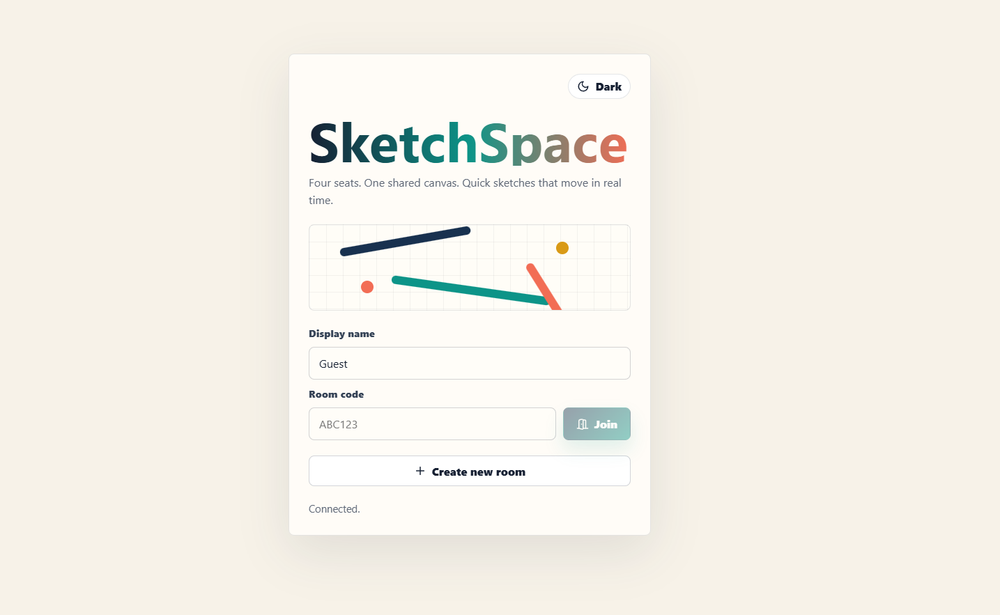
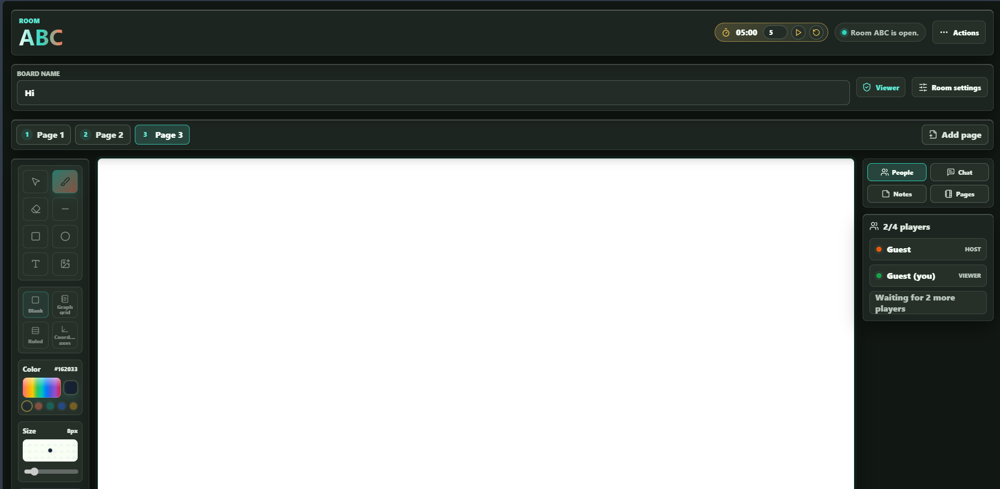

# SketchSpace

A real-time collaborative whiteboard built for live classes, tutoring sessions, and quick brainstorms. Multiple people draw on the same canvas at once, with role-based permissions, multi-page boards, and live chat — all synced over WebSockets.

Built with React, TypeScript, Canvas, Node.js, Express, Socket.IO, and MongoDB (falls back to an in-memory store when no database is configured).

## Contents

- [Screenshots](#screenshots)
- [Features](#features)
- [Tech Stack](#tech-stack)
- [Prerequisites](#prerequisites)
- [Getting Started](#getting-started)
- [Environment Variables](#environment-variables)
- [Available Scripts](#available-scripts)
- [Testing Collaboration Locally](#testing-collaboration-locally)
- [Keyboard Shortcuts](#keyboard-shortcuts)
- [REST API](#rest-api)
- [Socket Events](#socket-events)
- [Project Structure](#project-structure)
- [Troubleshooting](#troubleshooting)
- [Roadmap](#roadmap)

## Screenshots

| Lobby | Room |
| --- | --- |
|  |  |

## Features

**Rooms & Permissions**
- Create or join a room by code, with a shareable invite link
- Owner, editor, and viewer roles with granular permission controls
- Viewer editing toggle, viewer chat mute, request-attention mode, follow-presenter mode, and room lock

**Drawing**
- Real-time shared canvas: pencil, eraser, line, rectangle, circle, text, selection, move, and resize
- Per-page backgrounds: blank, graph grid, ruled paper, and coordinate axes
- Multi-page boards with a page sidebar for quick switching
- Export the current page as a PNG

**Collaboration**
- Live participants list, group chat, shared notes, and pages — all in a tabbed sidebar
- Live clock, countdown timer, and an in-app keyboard shortcuts reference

**Persistence**
- MongoDB-backed models for rooms, boards, messages, and session history
- Runs with an in-memory store when no database is configured, so it works out of the box

## Tech Stack

| Layer | Technology |
| --- | --- |
| Frontend | React, TypeScript, Vite, Canvas API, Socket.IO client |
| Backend | Node.js, Express, Socket.IO |
| Database | MongoDB via Mongoose (optional — in-memory fallback otherwise) |

## Prerequisites

- Node.js 18 or later
- npm
- A MongoDB connection string (local or [Atlas](https://www.mongodb.com/atlas)) — optional, only needed for persistence

## Getting Started

```bash
git clone https://github.com/ronin844/SketchSpace.git
cd SketchSpace
npm install
npm run dev
```

This starts both the client and server together:

- Client: `http://localhost:5173`
- Server: `http://localhost:4500`

## Environment Variables

Copy the example files and fill in your own values:

```bash
cp server/.env.example server/.env
cp client/.env.example client/.env
```

**`server/.env`**

| Variable | Description | Default |
| --- | --- | --- |
| `PORT` | Port the Express/Socket.IO server listens on | `4500` |
| `CLIENT_ORIGIN` | Allowed CORS origin for the client | `http://localhost:5173` |
| `MONGO_URI` | MongoDB connection string. Omit to run with the in-memory store | `mongodb://127.0.0.1:27017/sketchspace` |

**`client/.env`**

| Variable | Description | Default |
| --- | --- | --- |
| `VITE_SOCKET_URL` | URL the client uses to reach the Socket.IO server | `http://localhost:4500` |

## Available Scripts

Run from the repo root:

| Command | Description |
| --- | --- |
| `npm run dev` | Start client and server together in watch mode |
| `npm run dev:server` | Start only the server |
| `npm run dev:client` | Start only the client |
| `npm run build` | Build both server and client for production |
| `npm run typecheck` | Type-check both workspaces |

## Testing Collaboration Locally

1. Start the app with `npm run dev`.
2. Open `http://localhost:5173` in two browser tabs.
3. Create a room in the first tab.
4. Copy the invite link or room code.
5. Join from the second tab.
6. Draw, switch pages, send chat messages, and try the permission toggles.

## Keyboard Shortcuts

| Key | Action |
| --- | --- |
| `P` | Pen |
| `E` | Eraser |
| `T` | Text |
| `V` | Select |
| `L` | Line |
| `R` | Rectangle |
| `C` | Circle |
| `Ctrl + Z` | Undo |
| `Ctrl + Y` | Redo |
| `Ctrl + S` | Save status |
| `?` | Shortcuts help |

## REST API

**Rooms**
- `GET /api/rooms/:code`

**Boards**
- `GET /api/boards/:roomCode`
- `POST /api/boards/:roomCode/save`
- `GET /api/boards/recent`
- `GET /api/boards/:roomCode/history`

**Messages**
- `GET /api/messages/:roomCode`
- `POST /api/messages/:roomCode`
- `PATCH /api/messages/:messageId/pin`
- `DELETE /api/messages/:messageId`

**Exports**
- `POST /api/export/png`
- `POST /api/export/pdf`

## Socket Events

| Category | Events |
| --- | --- |
| Room | `room:create`, `room:join`, `room:update`, `participant:update` |
| Board | `stroke:start`, `stroke:draw`, `stroke:end`, `stroke:update`, `canvas:clear`, `canvas:undo`, `canvas:redo`, `board:template`, `page:create`, `page:switch` |
| Chat | `chat:message` |

Planned: cursor sync, request-attention, polls, announcements, page rename/delete/reorder, and owner moderation actions.

## Project Structure

```text
client/src/
  components/
  boardTemplates.ts
  socket.ts
  types.ts
server/src/
  config/
  models/
  routes/
  socket/
  state/
  types.ts
```

## Troubleshooting

**`querySrv ETIMEOUT` when connecting to MongoDB Atlas**
A `mongodb+srv://` connection string needs DNS SRV record lookups, which some ISP/router DNS servers don't support reliably. If `mongoose.connect` times out but the same connection string works in MongoDB Compass, your machine's default DNS resolver is likely the problem, not the connection string. The server already points Node's DNS resolution at public DNS (`8.8.8.8`, `1.1.1.1`) in [`server/src/server.ts`](server/src/server.ts) to work around this.

**`EADDRINUSE: address already in use`**
A previous `dev` process is still holding the port. Stop it (Windows: find the PID with `Get-NetTCPConnection -LocalPort <port>` in PowerShell and kill it with `taskkill /F /T /PID <pid>`; macOS/Linux: `lsof -i :<port>` then `kill <pid>`), or change `PORT` / `VITE_SOCKET_URL` to a free port on both sides.

## Roadmap

- Synced cursor layer with user names
- Host-controlled kick/transfer-host actions
- Page rename, duplicate, delete, and reorder
- Sticky notes, arrows, highlighter, laser pointer, image upload, and PDF import
- Autosave worker and restore-previous-session UI
- Export all pages as a single PDF
- Polls, quizzes, announcements, and a raised-hand queue
- State management split (Zustand or Context) for room, board, tools, chat, notes, and pages
